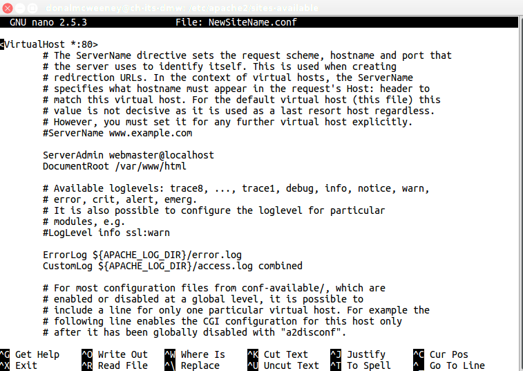
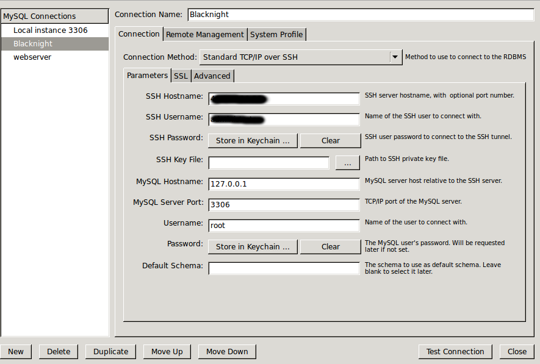
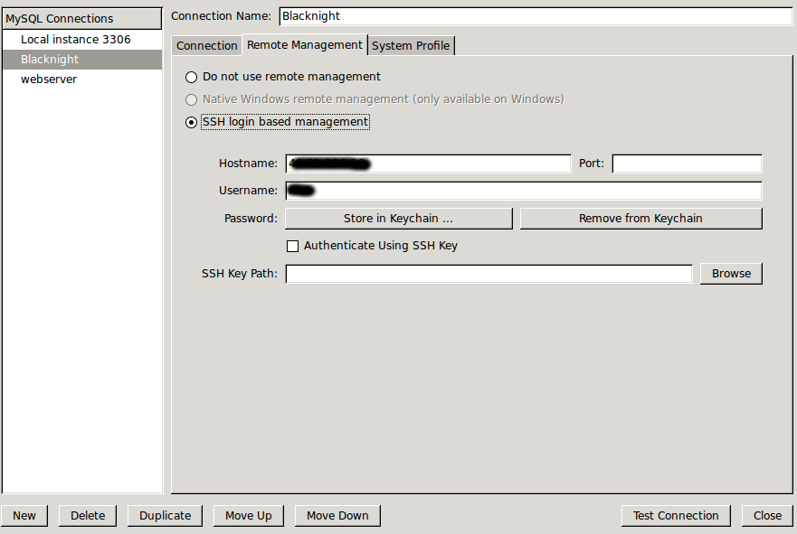
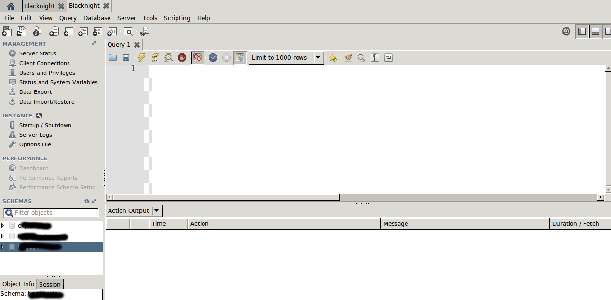
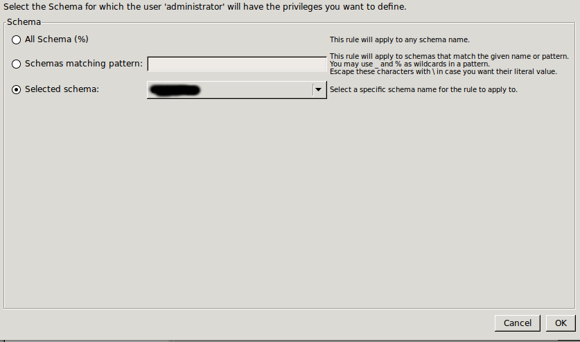

<!-- TOC depthFrom:1 depthTo:6 withLinks:1 updateOnSave:1 orderedList:0 -->

- [Web Server Notes](#web-server-notes)
	- [Connect to Server Via SSH](#connect-to-server-via-ssh)
	- [Install Drush](#install-drush)
	- [Drupal Setup](#drupal-setup)
	- [MySQL Setup](#mysql-setup)
	- [MySQL Setup (Command Line)](#mysql-setup-command-line)
	- [Drupal Setup](#drupal-setup)
	- [Drupal Settings File](#drupal-settings-file)
	- [Linux File Settings](#linux-file-settings)
	- [Drush Commands](#drush-commands)
		- [Clear Cache](#clear-cache)
		- [Install Module](#install-module)
		- [SQL Dump](#sql-dump)

<!-- /TOC -->

# Web Server Notes

## Connect to Server Via SSH

On windows use Putty.exe

On Linux Open Terminal and use SSH command

```bash
ssh exs535imwyxr6-dev@ssh.eu.platform.sh
```
Navigate to the following folder
```bash
cd /etc/apache2/sites-available
```
Copy the default file
```bash
sudo cp default-ssl.conf NewSiteName.conf
```
Edit New Conf file
```bash
sudo nano NewSiteName.conf
```


Use the up/down arrows to navigate through the document

Change the DoucmentRoot to point at the root of the website.

*Note the use of forward slashes.*

Exit nano:
```bash
Ctrl-x
```

You will be prompted to save

If you are using a port other than the default Port 80 it will have to be added to the ports.conf file

Navigate to the following folder
```bash
cd /etc/apache2
```
Edit ports.conf file
```bash
sudo nano ports.conf
```
Add new line for the port required under Listen 80:
```bash
Listen 80
Listen 8080
```
Use the a2ensite tool to enable each of our sites like this:
```bash
sudo a2ensite MyNewSite.conf
```

Restart Apache to make these changes take effect:
```bash
sudo service apache2 restart
```

More information is availble here:

https://www.digitalocean.com/community/tutorials/how-to-set-up-apache-virtual-hosts-on-ubuntu-14-04-lts

## Install Drush

Install Drush:

```bash
sudo apt-get install Drush
```

However, the Ubuntu Reporistories may not have the most up to date version of Drush. Use Drush to updgrade itself:

```bash
sudo drush dl drush --destination='/usr/share'
```

## Drupal Setup

Navigate to folder where Drupal files are to be stored. Usually /var/www:

```bash
cd /var/www
```
Create a folder to hold the Drupal Site:

```bash
sudo mkdir MyNewSite
```
---

## MySQL Setup

MySQL is installed as part of the LAMP installed

To connect to MySQL we can use MySQL workbench

Use the Connection Method: Standard TCP/IP over SSH



On the Remote Management Tab enter the SSH Hostname (Server IP Address) and SSH Username (or browse to SSH Key File).



Connect to Server




Click on an existing Schema (Database) and click:

```bash
Create Schema
```
Give the Database a name and click:

```bash
 Apply
 ```
 Next click:

 ```bash
  Users and Privileges
 ```
Select:
```bash
 administrator
```

(If this is a new install the user Administrator will have to be created)

Select:
```bash
 Schema Privileges
```

Select:
```bash
 Add Entry
```

Select:
```bash
 Selected schema
```

From the dropdown choose the required schema (Database)



Select:
```bash
 OK
```
On the subsequent Screen click:

Click:
```bash
 Select ALL
 Apply
```

---

## MySQL Setup (Command Line)

SSH on to Server

Type:
```sql
 mysql -u username -p -e "CREATE DATABASE databasename CHARACTER SET utf8 COLLATE utf8_general_ci";
```

Log in to database:
```sql
 mysql -u username -p
```

Create new user if necessary
```sql
 CREATE USER username@localhost IDENTIFIED BY 'password';
```

Give new user rights to the database:
```sql
 GRANT SELECT, INSERT, UPDATE, DELETE, CREATE, DROP, INDEX, ALTER, CREATE TEMPORARY TABLES ON databasename.* TO 'username'@'localhost' IDENTIFIED BY 'password';
```
(Do not use commas around username or password)

To exit MySQL:
```sql
 exit
```
N.B. MySQL commands end with a semi-colon ;
---

## Drupal Setup

In a browser navigate to http://mynewsite
This will start the Drupal Setup  wizard.

Follow the steps entering details for the database to install site.

---
## Drupal Settings File

Each Drupal installation contains a settings.php file. Go to:
```bash
/var/www/MyNewSite/sites/default
```

Create a settings file by copying the default settings file:
```bash
sudo cp default.settings.php settings.php
```

Edit the settings file:
```bash
sudo nano settings.php
```

Scroll down and edit the following block as appropriate:
```bash
$databases = array (
  'default' =>
  array (
    'default' =>
    array (
      'database' => 'MyNewSite',
      'username' => 'username',
      'password' => 'password',
      'host' => 'localhost',
     'port' => '3306',
      'driver' => 'mysql',
      'prefix' => '',
    ),
  ),
);
```

---
## Linux File Settings

If moving a site Drupal may give an error message about the files folder not being writable.

To resolve this go to the files folder:
```bash
cd /var/www/myNewSite/sites/default
```

To view the current permissions type:
```bash
cd ls -la
```

To resolve this go to the files folder:
```bash
drwxrwx---  12 www-data www-data  4096 May 25 11:02 files
```

If the permissions do not look like this they can be changed as follows:
```bash
sudo chmod -R 770 files
```

The "-R" flag is "Recursive" i.e. These changes will affect all files and folders withn the files folder.

You may need to change the owner of the files folder to the web server user:
```bash
sudo chown -R www-data:www-data files
```

To see more details on Drupal permissions got to https://www.drupal.org/node/244924

For more on Linux permissions go to
https://www.linux.com/learn/understanding-linux-file-permissions

---
## Drush Commands
The most commonly used Drush commands are:

### Clear Cache
```bash
drush cache-clear
```

or

```bash
druch cc
```

You will then be given a list of options e.g. "1" to clear all.

### Install Module

```bash
drush en module_name -y
```

### SQL Dump

To dump the database to a self contained database

```bash
drush sql-dump --result-file=MyNewSite.sql
```

More information on Drush Commands are here:

https://drushcommands.com/
